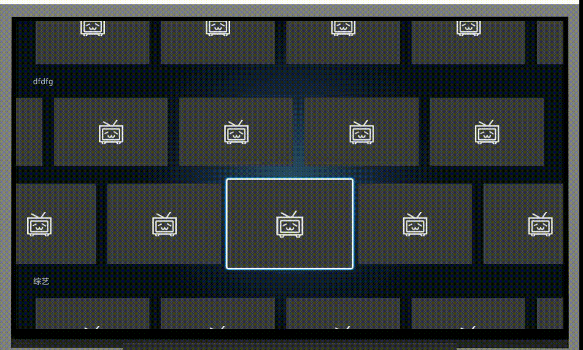
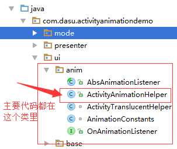

# ActivityAnimationDemo
一种 Activity 转场动画----点击哪里从哪放大

本篇提的动画方案适用于以下几种场景：  
1. **如果你的应用设置了 windowIsTranslucent 为 true 时，没有发现什么问题的话，那恭喜你，该动画方案可以兼容各种版本。**  

1. **如果你的应用设置了 windowIsTranslucent 为 true 时会有一些问题，但你的应用里没有播放器的话，那恭喜你，该动画方案可以兼容 19 及以上版本。**  

1. **如果你的应用设置了 windowIsTranslucent 为 true 时会有一些问题，而且应用里也有播放器的话，那如果你实在走投无路想使用该动画方案的话，那你再来找我吧，在研究出其他方案之前，咱们一起来慢慢填坑。**    

**注：本篇侧重点是介绍一种 Activity 动画方案的实现思路，注意，是思路！因为本篇所介绍的动画方案并不成熟，仍有很多坑，所以，学习、探讨就可以，慎用！**  

方案实现思路分析跳转 ==> 

# 效果图  
  

# 项目介绍  
如果对这种动画方案感兴趣的话，可以去看看代码。跟动画有关的代码都在 ui/anim 文件夹里。  

